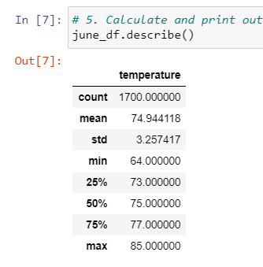
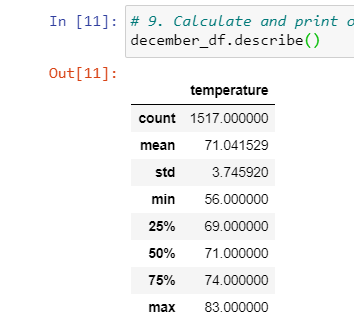
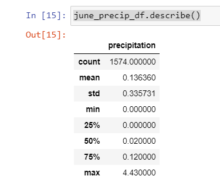
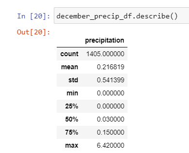

# surfs_up

# Overview of the analysis:

The purpose of this analysis is to determine if it will be a good idea for a business partner to open a surf shop in Oahu, Hawaii. The analysis was based on the weather data received from several weather stations across Oahu. I was able to run a query on the weather based on years, the month of June, the month of December. I also ran queries to see how often certain weather stations collected information.

# Results:

It seems that the weather in Oahu on June and December are similar and would be a good business venture to open a surf shop that you could consider good surfing conditions.

  - The minimum temperature for June was 64 degrees and in December it was 56 degrees
  - The average temperature for June was 74 degrees and in December it was 71 degrees
  - The maximum temperature for June was 85 degrees and in December it was 83 degrees
  
 ### Here is the completete summary statistics for the month of June's temperatures:
  
  
  
 ### Here is the complete summary statistics for the month of December temperatures:
  
  
  

# Summary: 

In order to really research if it is a good business idea to open up a surf shop in Hawaii based on weather, one would have to also consider looking at how often it rains in those months. Afterall, surfing in the rain would dampen any surfer's mood to surf. 

In general, surf season is best in the fall/winter months and based on the information from what I've found in analyzing the summary of temperatures and rain, business will be consistent all year long as the average downpour in June is 0.14 and December is 0.22

I ran the following queries in order to measure the amount of rain pour in June and December.

### This was the query run for June:

```
june_precip = []
june_precip = session.query(Measurement.date,Measurement.prcp).filter(extract('month', Measurement.date)==6)
```

### This was the query run for December:
```
december_precip = []
december_precip = session.query(Measurement.date,Measurement.prcp).filter(extract('month', Measurement.date)==12)
```

### Here is the output after running the query and the statistical summary for June:



### Here is the output after running the query and the statistical summary for December:




